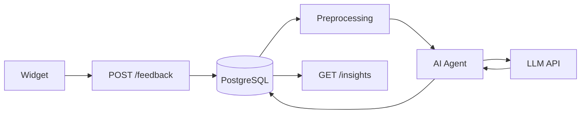

# 🧠 Feedback Intelligence

**Structured ingestion → Hybrid analysis → Actionable insights**

Transforms unstructured user feedback into decision-ready intelligence through deterministic analytics and LLM-powered reasoning.

---

## ⚡ System Architecture

```
Widget (JSON Schema) → Unified API → PostgreSQL (JSONB) → AI Agent → Insights
```

**Stack**: Node.js · Express · PostgreSQL · OpenAI/Anthropic · Docker

**Components**: 2 services + 1 database

---

## 🧩 Schema-Driven Widget

Dynamic form rendering from JSON configuration—zero redeployments:

```javascript
{
  "fields": [
    { "type": "rating", "id": "satisfaction", "max": 5 },
    { "type": "text", "id": "feedback", "required": true },
    { "type": "enum", "id": "category", "options": ["bug", "feature"] }
  ]
}
```

**Vanilla JS** · Single `<script>` embed · Platform-agnostic

---

## 🗄️ Hybrid Data Model

PostgreSQL with JSONB for relational integrity + document flexibility:

```sql
CREATE TABLE submissions (
  id UUID PRIMARY KEY,
  feedback_text TEXT NOT NULL,
  user_context JSONB,  -- Flexible metadata
  status VARCHAR(20),
  batch_id UUID REFERENCES batches(id)
);

CREATE INDEX idx_context ON submissions USING GIN (user_context);
```

**ACID transactions** · **GIN indexes** for JSON queries · **Foreign key constraints**

---

## 🔬 Hybrid Intelligence Engine

### Deterministic Layer
- Frequency distribution & temporal aggregation
- Statistical sentiment scoring
- Pattern-based urgency detection

### AI Layer (ADK & Vertex AI)
- Scheduled (Daily/Biweekly/Weekly) processing.
- Semantic theme clustering
- Intent extraction & urgency classification
- Prioritized recommendation synthesis

**Token-aware batching**: 6K limit · 4:1 char-to-token estimation · Async processing

---

## � Data Flow



**Async by default**: Instant submission response · Background processing · Manual trigger via `/process`

---

## 🎯 API Endpoints

```bash
POST   /api/v1/feedback      # Submit feedback
GET    /api/v1/feedback      # Query submissions (paginated)
GET    /api/v1/insights      # Retrieve AI analysis
POST   /api/v1/process       # Manual pipeline trigger
GET    /api/v1/health        # Health check
```

---

## 🚀 Technical Implementation

| Component | Details |
|-----------|---------|
| **Widget** | React iife js file · CDN deliverry· Client-side validation |
| **Unified API** | Express · Connection pool (10) · Node-cron scheduler |
| **Preprocessing** | Idempotent batching · Rollback on failure · Status tracking |
| **AI Agent** | Direct LLM calls · JSON mode · 2-retry backoff |
| **Database** | PostgreSQL 17 · JSONB + relational · GIN indexes |

---

## 📈 Performance

- **Ingestion**: <100ms (p95)
- **Batch processing**: 5-min intervals
- **AI analysis**: 10-30s per batch
- **Throughput**: 50+ req/s (single instance)

---

**Built for hackathons. Ready for production.**

*Feedback is abundant. Intelligence is rare.*
